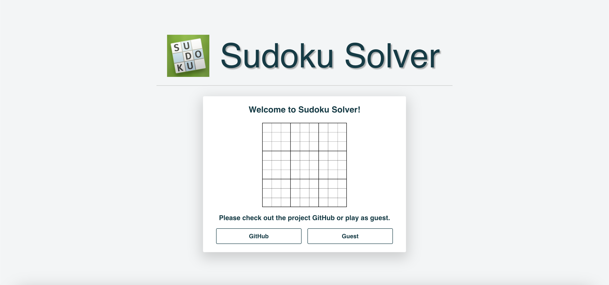
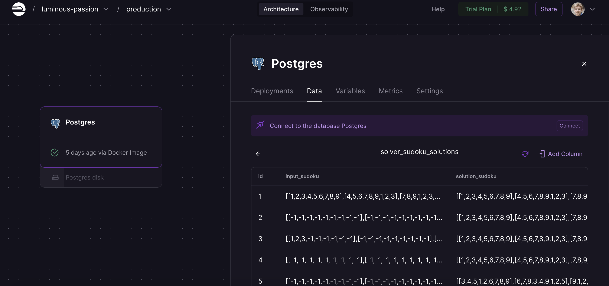

# Sudoku Solver
Sudoku Solver is a robust application that provides near-instantaneous board solutions to Sudoku boards. The application was built using Django, React, PostgreSQL, Docker, Docker Compose, Nginx, Gunicorn, AWS EC2, and Railway.

## Landing Page

This page functions as the landing page where a user can proceed to play or read the docs on GitHub. This page was built with React, HTML, and CSS.

## Solver

This React interface allows users to traverse input squares using cursors. When the user has finished inputting his/her board, he/she may process it by either resetting their board or by solving their board! This page was built using React, HTML, and CSS.

## Solution Example
### Input

### Output

When a board is sent as an HTTP POST request, the railway database is queried. If a solution for the input is found, that is returned in the form of a JSON response. If there is no database result found, the backend algorithm is run, the input and result are stored in the database, and the solved board is sent back to the frontend as a JSON response.

## PostgreSQL Railway

Here is one of the tables associated with the Django app. This database stores the Sudoku input and corresponding solution board. The PostgreSQL Railway database is queried via Django model classes and attributes.

## Setup
If you'd like to play and test the application, please visit the site (the link can be found in the project description). If you'd like to run the site, you must install Docker. After installation, you may run it locally by performing the following steps:
```sh
# Clone the repository.
git clone https://github.com/DanielRamsgard/Sudoku-Solver

# Navigate to the project directory.
cd Sudoku-Solver

# Change AWS EC2 ip address to 'localhost' in React files
54.225.36.165 => localhost

# Run Docker Compose
docker-compose up --build

# After debugging, the application runs on 'http://localhost'
```
